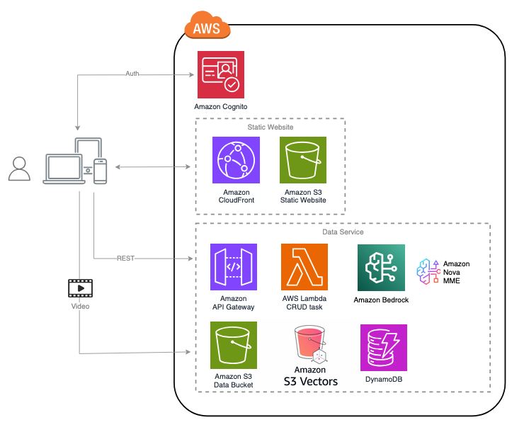

# Demo of Amazon Nova Multimodal Embedding (MME)

> This solution is available as a CDK package and can be deployed to your AWS account by running just a few simple scripts.

This application serves as a demo to showcase [**Amazon Nova’s multimodal embedding**](https://aws.amazon.com/blogs/aws/amazon-nova-multimodal-embeddings-now-available-in-amazon-bedrock/) capabilities in [**Amazon Bedrock**](https://aws.amazon.com/bedrock/), enabling unified search across text, images, video, and audio. It can be used as a quick start to explore Nova MME features, deliver demonstrations, or serve as a reference architecture for your own applications.

The application includes an interactive web interface where you can upload multimedia files, perform cross-modal searches, and experience how embeddings power intelligent content discovery across different modalities.

## Table of Contents

- [Demo Recording](#demo-recording)
- [Architecture](#architecture)
- [Performance Optimization](#performance-optimization)
- [Prerequisites](#prerequisites)
- [Deployment Steps](#deployment-steps)
- [Deployment Validation](#deployment-validation)
- [Running the Guidance](#running-the-guidance)
- [Cleanup](#cleanup)

## Demo recording


## Architecture

Nova MME is built on a modern serverless architecture using AWS services for scalability, reliability, and performance. The system processes multimedia content through a pipeline that extracts embeddings and stores them in a vector database for efficient semantic search.



### Core Components

- **Frontend:** React-based web application providing an intuitive interface for uploading media and performing searches
- **Amazon API Gateway:** RESTful API endpoints for secure communication between frontend and backend services
- **AWS Lambda Functions:** Serverless compute layer handling media processing, embedding generation, and search operations
- **Amazon DynamoDB:** Store the MME task metadata
- **Amazon S3:** Scalable object storage for media files (videos, images, audio, documents)
- **Amazon CloudFront:** Global CDN for optimized media delivery with 40-60% faster video playback
- **Amazon S3 Vectors:** Serverless vector storage for efficient similarity search across embeddings
- **Amazon Bedrock:** Foundation model access providing the underlying AI capabilities for embedding generation and semantic understanding

### Multi-Modal Embedding Process


The embedding process transforms different content types into a shared vector space, enabling cross-modal search capabilities where you can find videos using text queries, discover images through natural language, or locate audio clips based on semantic similarity.

## Performance Optimization

### CloudFront Media Delivery

This solution automatically configures **Amazon CloudFront** for optimized media delivery, providing:

- **40-60% faster video playback** compared to direct S3 access
- **Global edge caching** for reduced latency worldwide
- **Automatic failover** and high availability
- **Bandwidth optimization** with intelligent caching

#### How It Works

All media files (videos, images, audio) are automatically served through CloudFront:

1. **Automatic Configuration**: During deployment, the CDK stack automatically:
   - Creates a CloudFront distribution for the data bucket
   - Configures Origin Access Identity (OAI) for secure S3 access
   - Updates all Lambda functions with the CloudFront domain
   - Stores the CloudFront domain in SSM Parameter Store

2. **Seamless Integration**: Lambda functions automatically use CloudFront URLs:
   - `nova-srv-search-vector` - Vector search results
   - `nova-srv-search-vector-rag` - Conversational search
   - `nova-srv-get-video-tasks` - Video task listings

3. **No Manual Steps Required**: Everything is configured automatically during `cdk deploy`

#### Security (Optional Enhancement)

For production deployments requiring additional security, you can implement **CloudFront Signed URLs** to ensure only authenticated users can access media files. See `deployment/CLOUDFRONT_SIGNED_URLS_IMPLEMENTATION_GUIDE.md` for detailed implementation steps.

## Prerequisites

- If you don't have the AWS account administrator access, ensure your [IAM](https://aws.amazon.com/iam/) role/user has permissions to create and manage the necessary resources and components for this solution.
- In Amazon Bedrock, make sure you have access to the required models: 
    - Nova multimodal embedding
    - Nova Lite 1.0

### Install environment dependencies and set up authentication

<details><summary>
:bulb: Skip if using CloudShell or AWS services that support bash commands from the same account (e.g., Cloud9). Required for self-managed environments like local desktops.
</summary>

- [ ] Install Node.js
https://nodejs.org/en/download/

- [ ] Install Python 3.9+
https://www.python.org/downloads/

- [ ] Install Git
https://github.com/git-guides/install-git

- [ ] Install Pip
```sh
python -m ensurepip --upgrade
```

- [ ] Install Python Virtual Environment
```sh
pip install virtualenv
```


- [ ] Setup the AWS CLI authentication
```sh
aws configure                                                                     
 ```                      
</details>


If your CloudShell instance has older dependency libraries like npm or pip, it may cause deployment errors. To resolve this, click 'Actions' and choose 'Delete AWS CloudShell Home Directory' to start a fresh instance.

### Supported Regions
The solution requires AWS AI and Generative AI services, including Amazon Bedrock, Amazon Rekognition and Amazon Transcribe, which are available in certain regions. Please choose one of the below AWS regions to deploy the CDK package.

|||||
---------- | ---------- | ---------- | ---------- |
US | us-east-1 (N. Virginia) | ||

## Deployment Steps
1. Clone the source code from GitHub repo 

```
git clone https://github.com/aws-samples/sample-demo-of-nova-mme.git
cd sample-demo-of-nova-mme
```

2. Set up environment varaibles 

Set environment variables as input parameters for the CDK deployment package:

CDK_INPUT_USER_EMAILS: Email address(es) for login to the web portal. They will receive temporary passwords.
```
export CDK_INPUT_USER_EMAILS=<EMAILS_SPLIT_BY_COMMA>
```

Update the values with your target AWS account ID and the region where you intend to deploy the demo application.
```
export CDK_DEFAULT_ACCOUNT=<YOUR_ACCOUNT_ID>
export CDK_DEFAULT_REGION=<YOUR_TARGET_REGION> (e.x, us-east-1)
```

3. Run **deploy-cloudshell.sh** in CloudShell to deploy the application to your AWS account with the parameters defined in step 2.
```
cd deployment
bash ./deploy-cloudshell.sh
```

## Deployment Validation

Once the deployment completes, you can find the website URL in the bash console. You can also find it in the CloudFormation console by checking the output in stack **NovaMmeRootStack**.

## Running the Guidance
- If you provided one or more email addresses through the environment variable `CDK_INPUT_USER_EMAILS` during setup, an email containing a username and temporary password will be sent to those addresses as part of the deployment process. Users can use these credentials to sign in to the web portal.

- If `CDK_INPUT_USER_EMAILS` was set, you will need to manually create a user by navigating to the Cognito console and adding a user to the **nova-mme-user-pool**.

## Cleanup

When you’re finished experimenting with this solution, clean up your resources by running the command from CloudShell:

```
cdk destroy
```

These commands deletes resources deploying through the solution. 
You can also go to the CloudFormation console, select the `NovaMmeRootStack` stack, and click the Delete button to remove all the resources.